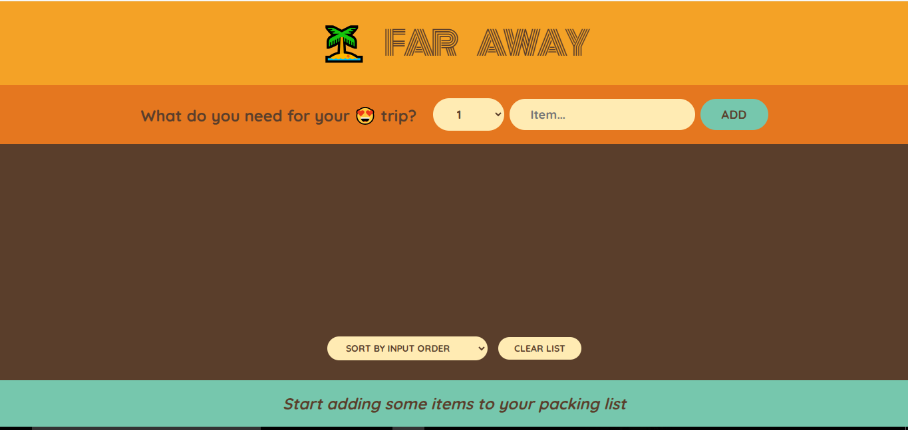
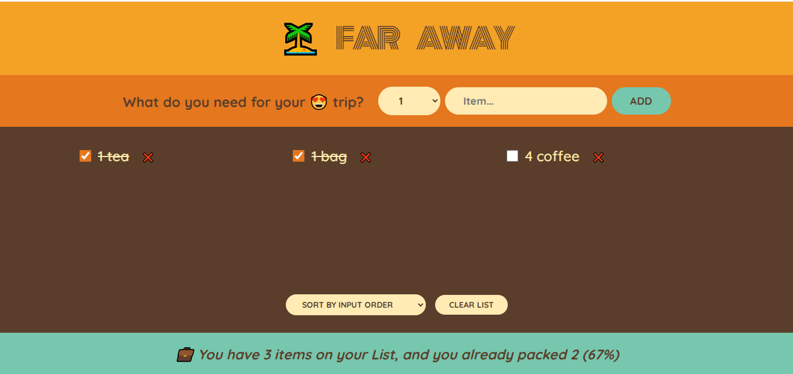

# PackMyBag

## Introduction

PackMyBag is a React application designed to help users manage their packing lists efficiently. Users can add items, mark them as packed, and clear the list when needed.

## How to Use the App

1. **Add Items**: Use the input form to add items to your packing list.
2. **Toggle Packed Status**: Click on an item to mark it as packed or unpacked.
3. **Delete Items**: Remove individual items from the list.
4. **Clear List**: Click the clear button to delete all items from the list after confirmation.

## Functionalities

- Add, delete, and toggle items in the packing list.
- Clear the entire list with user confirmation.
- Display statistics related to the packing list.

## Tech Stack

- React
- JavaScript
- CSS
- Create react app

## How to Clone and Run the Application

1. Clone the repository:
   ```bash
   git clone https://github.com/Jatinsharma43/PackMyBag.git
   ```
2. Navigate to the project directory:
   ```bash
   cd PackMyBag
   ```
3. Install dependencies:
   ```bash
   npm install
   ```
4. Start the application:
   ```bash
   npm start
   ```

## Learnings from the Project

- Understanding state management in React using hooks.
- Building reusable components for better code organization.
- Implementing user interactions and confirmations.

## Screenshots



